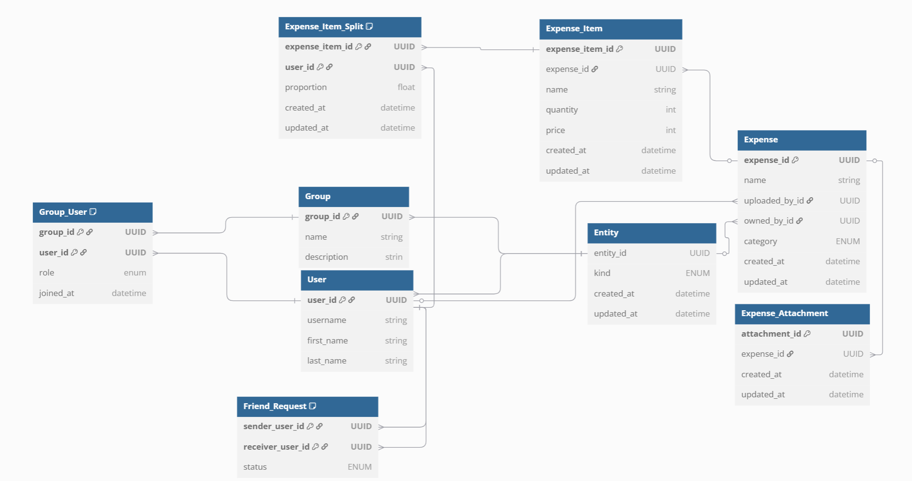

- put in image and talk about pros and cons. e.g. doing the splitting on an item level
- talk about other options but hwp they can be replaced with the use of views. 
- This is specifically for the tables and their use rather than the specific columns in them
# Database Table Layout
- Short phrase that describes the key decision.
- put in db image
#### Date: 15/04/2025
- When the decision was made.
#### Status: accepted
- Current status of the decision (i.e. proposed, accepted, deprecated, superseded or rejected).
## Summary 
- Summarise the decision and its rationale.

## Context 
- Describe the facts that influence the decision. State these in value-neutral language.
- Can probably have a table here of pros and cons
## Decision 
- Explain how the decision will solve the problem, in light of the facts presented in the context.
## Consequences 
- Describe the impact of the decision. What becomes easier and harder to do? There will
be positive, neutral and negative consequences, identify all of them.